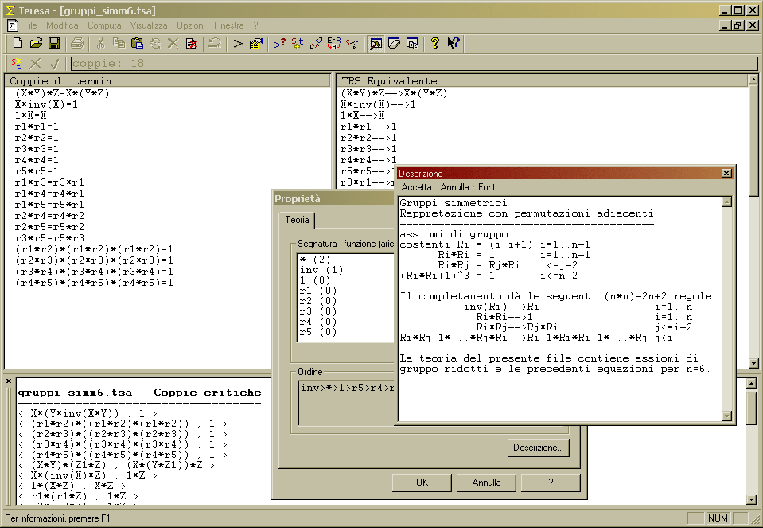

# Teresa

 TErm REwriting Systems Application

ver. 1.0.1.1  
18/10/2001

Copyright (C) 2001 Marco Bortolin, Alberto Minora

## General information

Teresa is the acronym of TErm REwriting Systems Application. The scope of the program is to allow the study of [term rewriting systems](https://en.wikipedia.org/wiki/Rewriting) with the following functionality:

* Term orientation with LPO
* Unification
* Critical pairs search
* Huet completion method
* Word problem solution

Teresa was born as a project for the Mathematical Logic II course by Prof. Ghilardi at the Computer Science Department of the University of Milan (academic year 2000-2001).

The main program is a MFC application for Microsoft Windows, though the term rewriting core is reusable on any project and operating system.

*Note*: the program and the documentation are in **italian only**.

## Informazioni generali

Teresa è l'acronimo di TErm REwriting Systems Application ovverosia Applicazione per i Sistemi di Riscrittura. Il programma si prefigge lo scopo di agevolare l'analisi ed il trattamento dei sistemi di riscrittura fornendo all'utente le seguenti funzionalità:

* Orientamento di termini tramite LPO
* Unificazione
* Ricerca di coppie critiche
* Completamento tramite la procedura di Huet
* Risoluzione del problema della parola

Teresa è nato come progetto d'esame per il corso di Logica 2 tenuto dal prof. Ghilardi presso il DSI (Dipartimento Scienze dell'Informazione) di Milano (anno accademico 2000-2001).

Teresa è stato concepito per funzionare sul sistema operativo Microsoft Windows, sebbene il suo cuore per il term rewriting sia riutilizzabile per qualsiasi progetto che necessiti delle sue funzionalità e operante su S.O. diversi.

## Installazione

Non esistono e nemmeno sono previste procedure di installazione automatica. Scompattare l'archivio teresa-1.0.zip in una directory a propria scelta. Lanciare da tale directory il file teresa.exe.

E' necessario che nel sistema sia presente la libreria `MSVCP60.DLL`, che deve trovarsi o in `\WINDOWS\SYSTEM` oppure nella stessa directory nella quale è stato installato Teresa.

Teresa si serve del registro di Windows per memorizzare alcune impostazioni; le modifiche al registro sono situate in `HKEY_CURRENT_USER\Software\Teresa` e `HKEY_USERS\.DEFAULT\Software\Teresa`

## Disinstallazione

Rimuovere la directory nella quale si è scompattato l'archivio teresa-1.0.zip

Rimuovere dal registro di Windows le voci `HKEY_CURRENT_USER\Software\Teresa` e `HKEY_USERS\.DEFAULT\Software\Teresa`

## Requisiti di sistema

**Processore**: Intel 486 o 100% compatibile (consigliato classe 586)  
**Memoria**: testato con successo con 64MB  
**Sistema Operativo**: Microsoft Windows 95/98/98SE/ME (non testato su NT/2000/XP)

## Licenza

Questo programma è free software; puoi ridistribuirlo e/o modificarlo sotto i termini della GNU General Public License pubblicata dalla Free Software Foundation (versione 2).

Questo programma è distribuito nella speranza che sia utile ma SENZA ALCUNA GARANZIA; senza nemmeno la implicita garanzia di IDONEITA' A UN UTILIZZO SPECIFICO. Leggi la GNU General Public License per ulteriori informazioni.

Avresti dovuto ricevere una copia della GNU General Public License insieme a questo programma; se così non è stato scrivi alla Free Software Foundation, Inc., 675 Mass Ave, Cambridge, MA 02139, USA.

## Changelog

ver.      : 1.0.1.1  
rel. date : 18/10/2001

- Eliminato un bug che impediva il test dell'ordine (senza "dettagli") dopo un completamento.

- Microscopici aggiustamenti al codice.

ver.      : 1.0  
rel. date : 01/10/2001

- Prima versione ufficiale di Teresa.